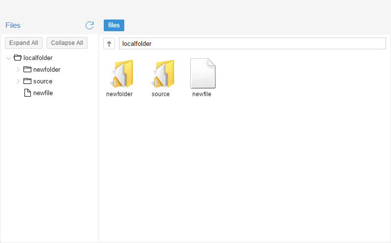
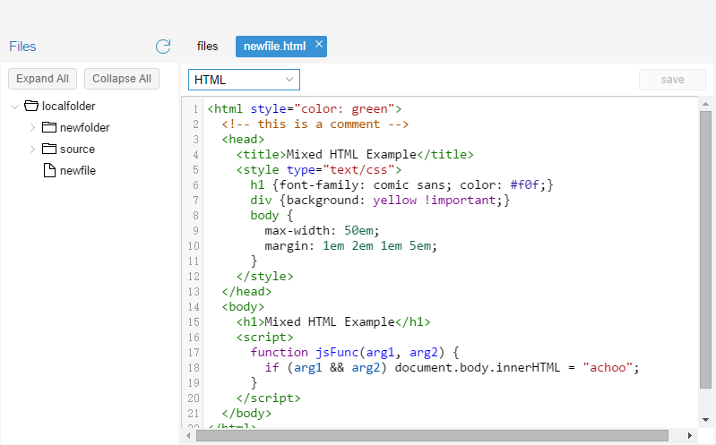

## extjs-filebrowser

A simple filemanager to manage your files in the browser developed in ``ExtJS`` and ``CodeMirror`` by dmemoing.

#### [Try the DEMO](http://dmemoing.github.io/extjs-filebrowser/build/FileBrowser/)

### Features
  - Newfile, NewDirectory 
  - Copy, Move, Rename
  - Delete, Edit, Preview
  - Source code highlight 

### TODO
  - file upload and download

### Backend API
[Read the docs](app/API.md)

---------

### Use in your existing project
The filebrowser widget is based on ExtJS 6 and CodeMirror.
You can download the ExtJS 6.0 GPL in [http://cdn.sencha.com/ext/gpl/ext-6.0.0-gpl.zip](http://cdn.sencha.com/ext/gpl/ext-6.0.0-gpl.zip).  ExtJS 5 should alse work.
There is the necessary codemirror file in `resources/lib`.You can find more information about it in [	http://codemirror.net/](http://codemirror.net/).
The whole project is generated by `sencha cmd`. I ignore the `ext/` of the  project.
The source code of the widget is in `app/FileBrowser`. The `app/application.js` is an example of this wight. You can use the widget like this.
In `index.html`, there are two variables. `serverAddress` is the address of your backend. `token` is used for authorization. If you don't need, you can set it with null. 

